# JavascriptAngularSales

This project was generated with [Angular CLI](https://github.com/angular/angular-cli) version 7.3.9.

## Prerequisites 🚀

1. Install Windows 10
2. Install node.js version v8.9.4
3. Install npm version 5.6.0
4. (No mandatory) Install angular-cli version 7.3.9.
5. Install google Chrome 64 Bits Version 64.0 or IE11

## Google Chrome 64

1. Install "Allow CORS: Access-Control-Allow-Origin" Plugin for Chrome.
2. Install "Augury" Plugin for Chrome.
3. Start google with win run: chrome.exe --user-data-dir="C://Chrome dev session" --disable-web-security

  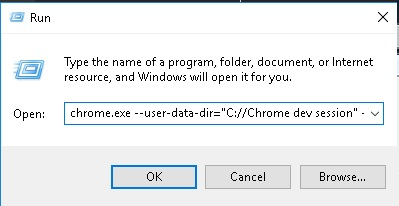

## IE11

1. Do the following configuration.

  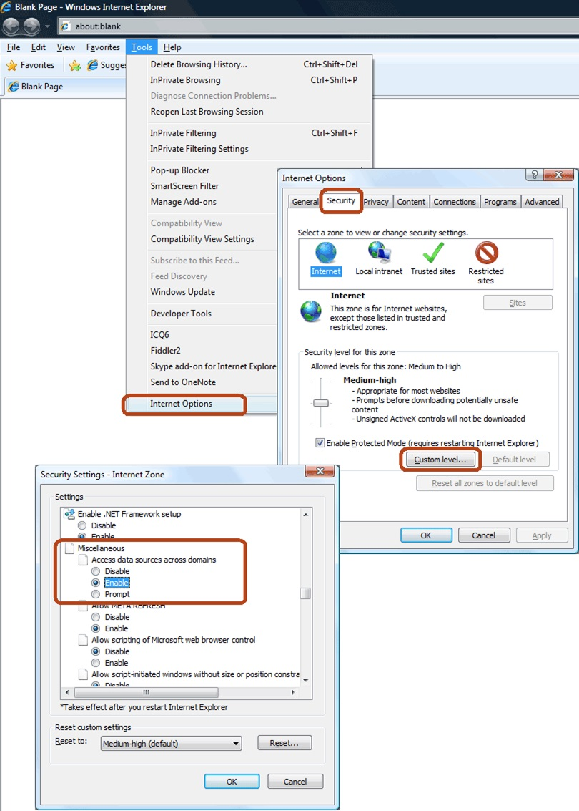

## Installation 🔧

1. Deploy the following backend project: https://github.com/RichardSeverich/java-spring-sales
2. Clone Repository: https://github.com/RichardSeverich/javascript-angular-sales.git
3. Configuration: Set the api host and port to: src/environments/environment.ts
4. Install Dependencies: npm install

## Screens

### Login

  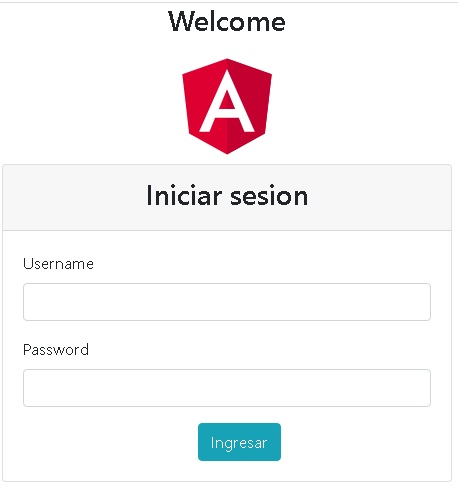

### Nav Bar

  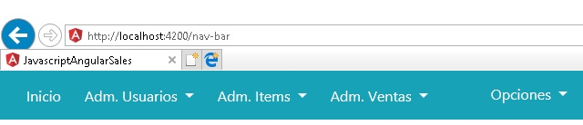

### Users Table

  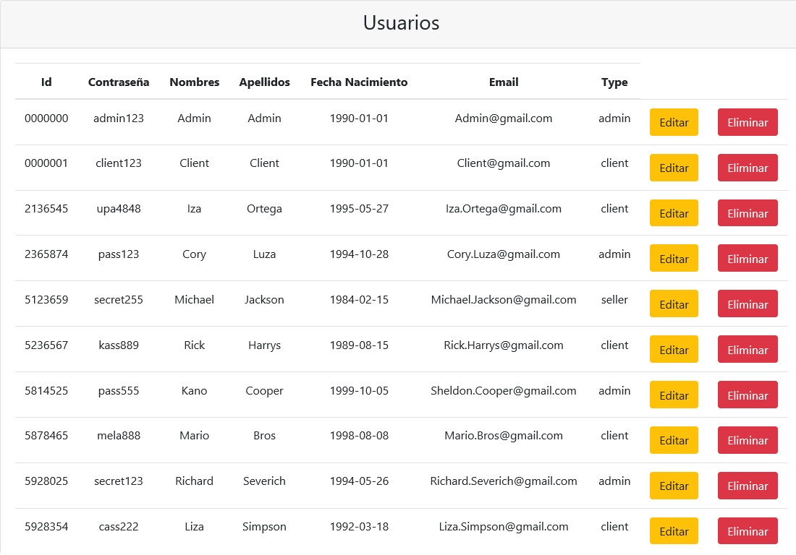

### Users Form

  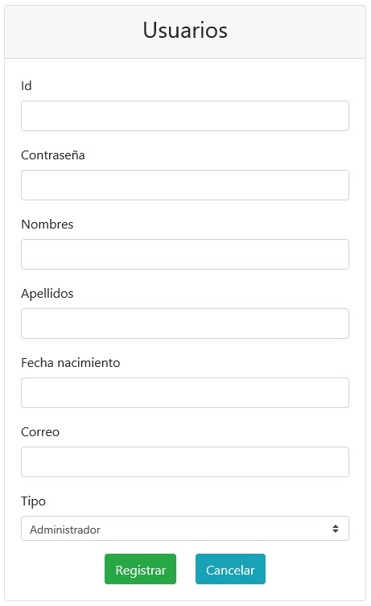

### Items Table

  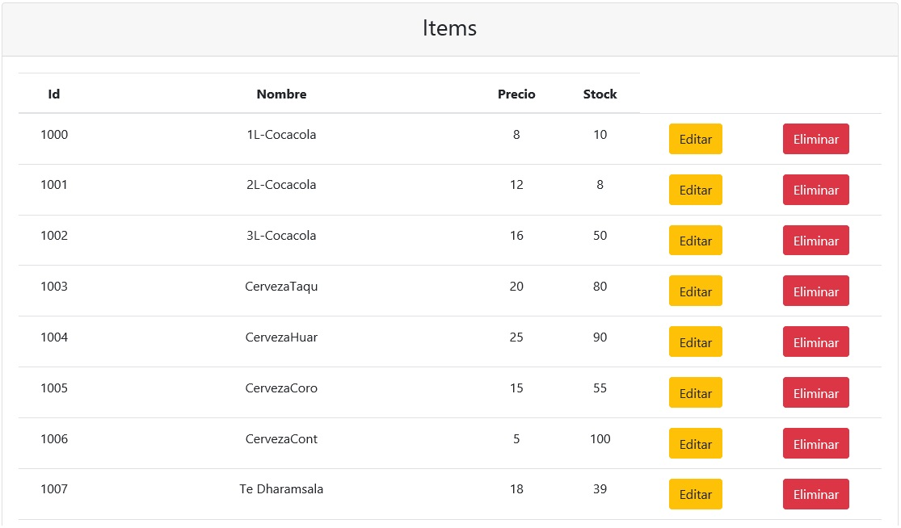

### Items Form

  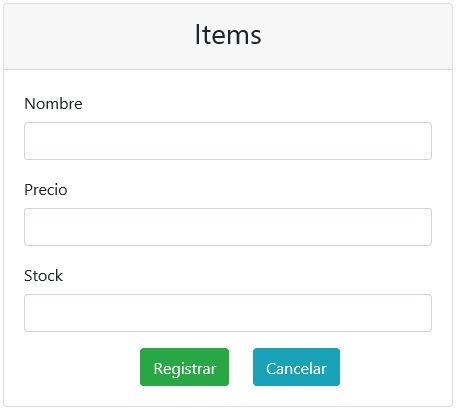

### Sales Table

  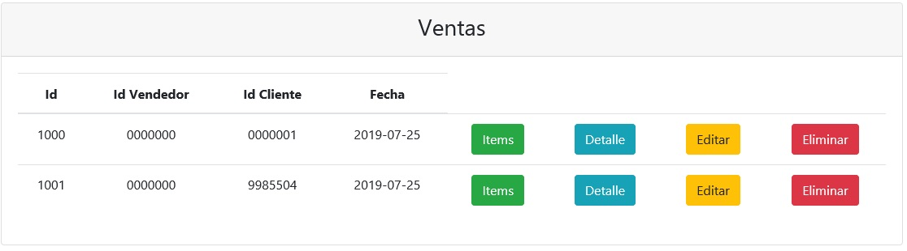

### Sales Form

  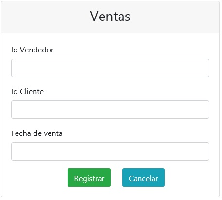

### Sales Table Items

  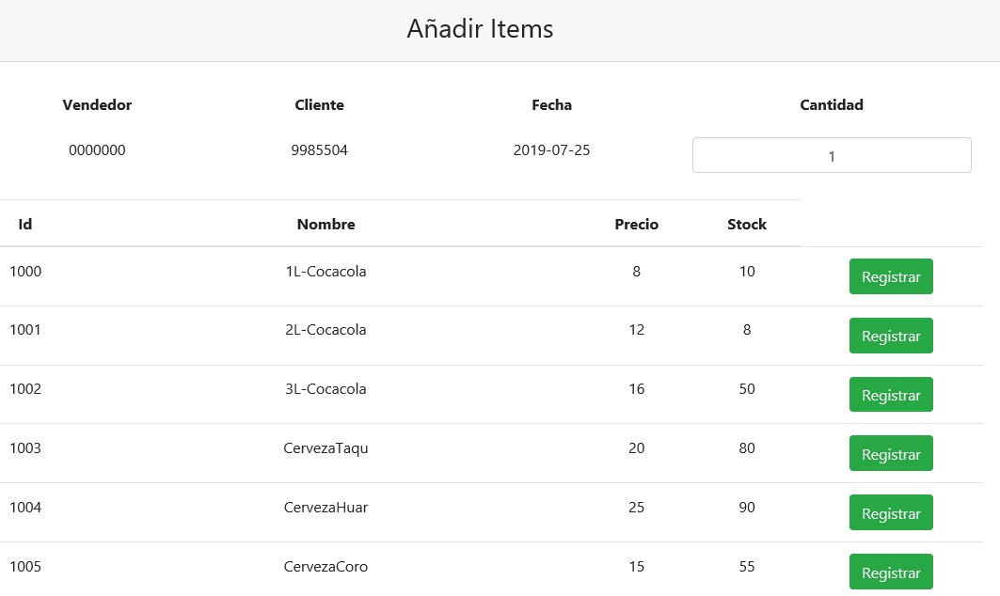

### Sales Table Details

  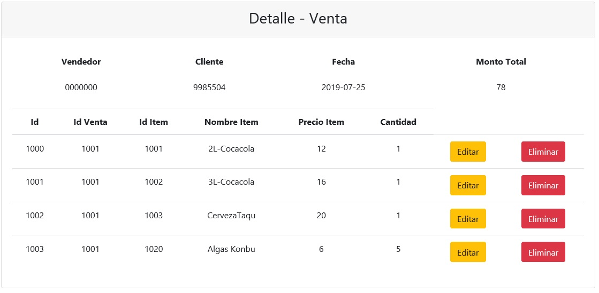

## Diagrams

### Flow

  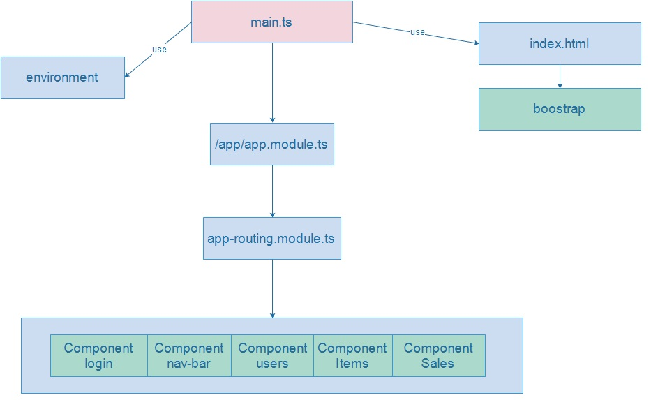

### Descriptions

  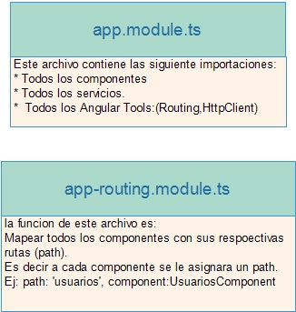

### Structure

  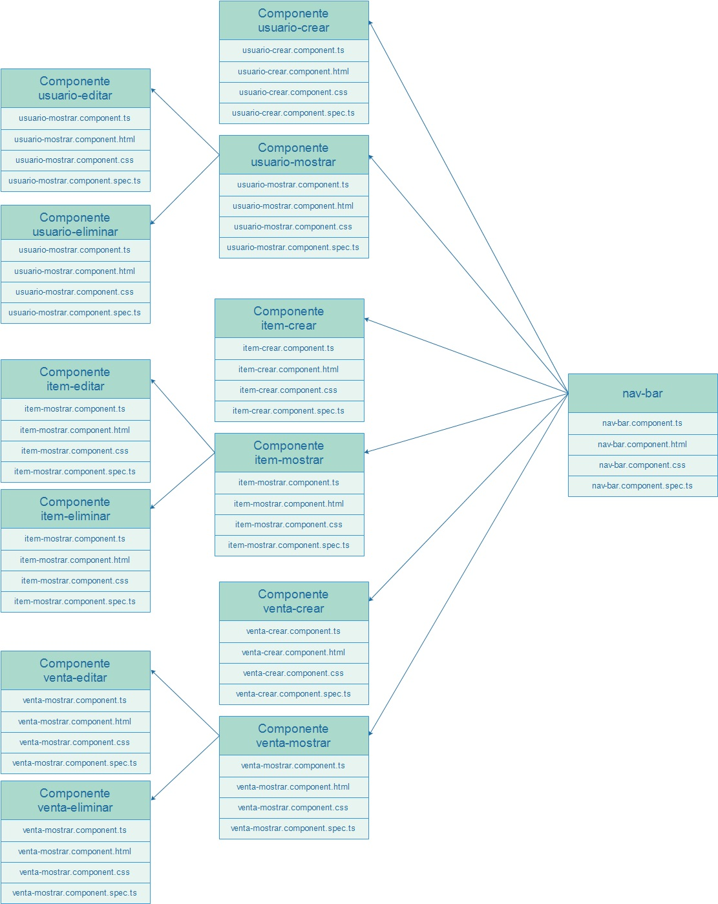

## Development server

Run `ng serve` for a dev server. Navigate to `http://localhost:4200/`. The app will automatically reload if you change any of the source files.

## Code scaffolding

Run `ng generate component component-name` to generate a new component. You can also use `ng generate directive|pipe|service|class|guard|interface|enum|module`.

## Build

Run `ng build` to build the project. The build artifacts will be stored in the `dist/` directory. Use the `--prod` flag for a production build.

## Running unit tests

Run `ng test` to execute the unit tests via [Karma](https://karma-runner.github.io).

## Running end-to-end tests

Run `ng e2e` to execute the end-to-end tests via [Protractor](http://www.protractortest.org/).

## Further help

To get more help on the Angular CLI use `ng help` or go check out the [Angular CLI README](https://github.com/angular/angular-cli/blob/master/README.md).

## Contributing 🖇️

1. Fork it!
2. Create your feature branch: `git checkout -b issue/1001`
3. Commit your changes: `git commit -m 'issue/1001: Add some feature'`
4. Push to the branch: `git push origin issue/1001`
5. Submit a pull request.

## License 📄

- Copyright (c) 2019 by Richard Severich, Inc. All Rights Reserved.
- This software is the confidential and proprietary information of
- Richard Severich. ("Confidential Information").
- You may not disclose such Confidential Information, and may only
- use such Confidential Information in accordance with the terms of
- the license agreement you entered into with Richard Severich.
